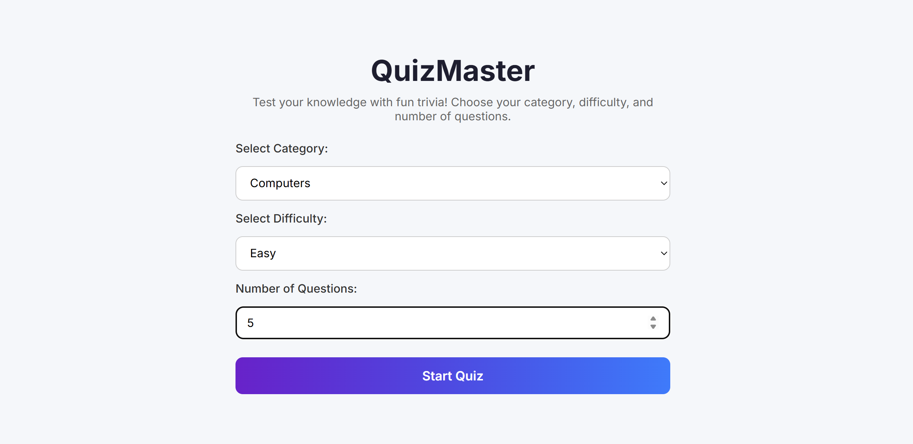
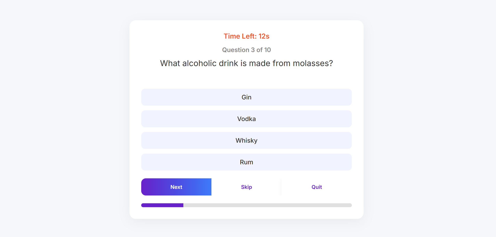
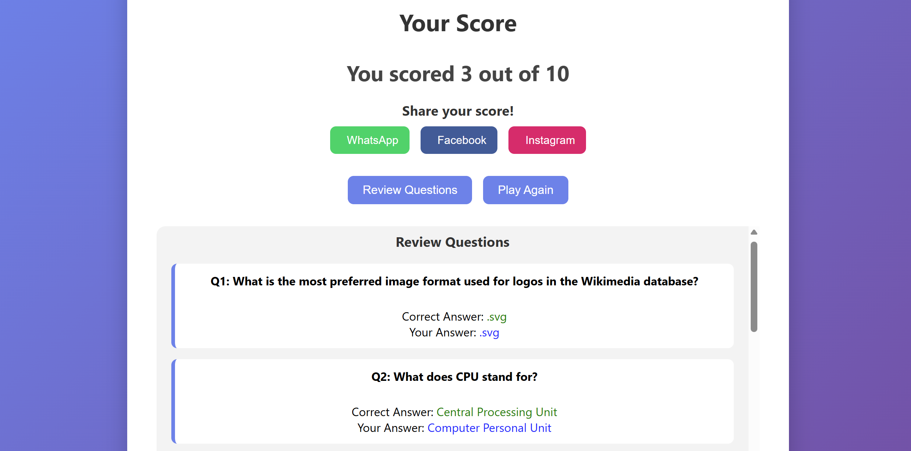

# QuizMaster 🎯

QuizMaster is a fun and interactive web-based quiz application that allows users to test their knowledge on various topics. Users can play quizzes, track their scores, review questions, and share their results on social media. Built with HTML, CSS, and JavaScript, it provides a smooth and engaging experience.

---

## Features

- **Multiple Categories & Difficulty Levels:** Choose your preferred category and difficulty level for quizzes.
- **Timed Questions:** Each question has a countdown timer to keep the challenge exciting.
- **Score Tracking:** View your final score at the end of the quiz.
- **Review Questions:** Review all questions along with correct answers after completing the quiz.
- **Social Sharing:** Share your score easily on WhatsApp, Facebook, and Instagram.
- **Play Again:** Quickly restart the quiz to improve your score.
- **Responsive Design:** Works on desktops, tablets, and mobile devices.

---


---

## Screenshots

**Home Page**



 **Quiz Page**

 

**Score Page**



---

## Technology Stack

- **Frontend:** HTML, CSS, JavaScript
- **API:** [Open Trivia Database API](https://opentdb.com/) for quiz questions


---

## How to Run Locally

1. Clone the repository:

```bash
git clone https://github.com/Neha-238/QuizMaster.git
